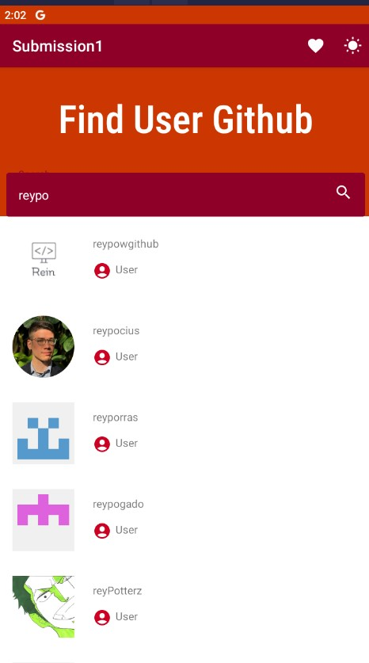
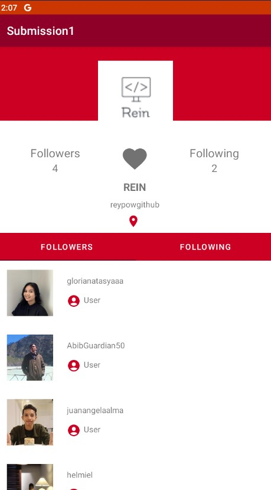

# Submission_Dicoding-Android_Fundamental
Dibuat oleh Reynhard Powiwi 👨‍💻

# Github Search User 🔍
Pada project kali ini, saya membuat aplikasi GitHub Search User. Aplikasi ini memiliki fitur untuk mencari user pada GitHub dengan menggunakan Retrofit untuk mengambil data. Berikut adalah penjelasan fitur-fitur yang ada pada aplikasi ini:

- 🔍 Fitur Search User  : Aplikasi ini dilengkapi dengan fitur search user yang memungkinkan pengguna untuk mencari user pada GitHub
- ℹ️ Fitur Detail User : pengguna dapat melihat informasi lengkap mengenai pengguna tersebut, termasuk jumlah followers dan following yang dimilikinya.
- ❤️ Fitur Like : Hal ini memungkinkan pengguna untuk dengan mudah melihat daftar user yang disukai.

# Screenshot Aplikasi 📷
Berikut adalah beberapa screenshot dari aplikasi GitHub Search User:

   

Selamat mencoba 😉✨
